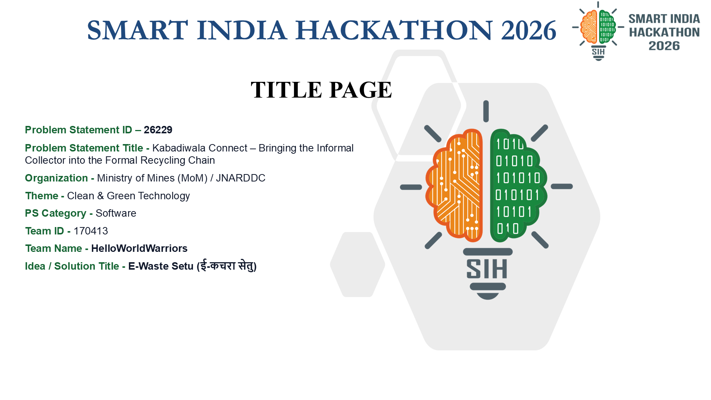
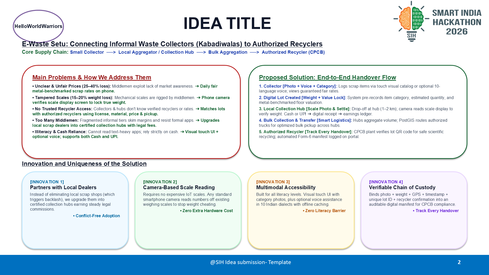
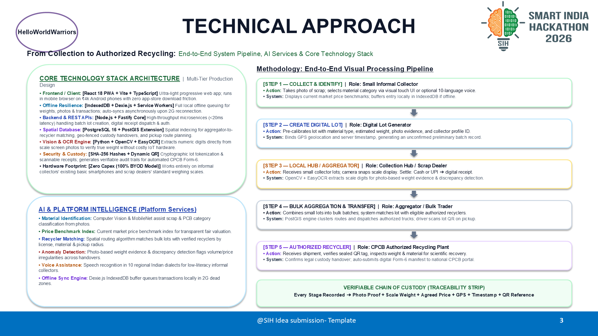
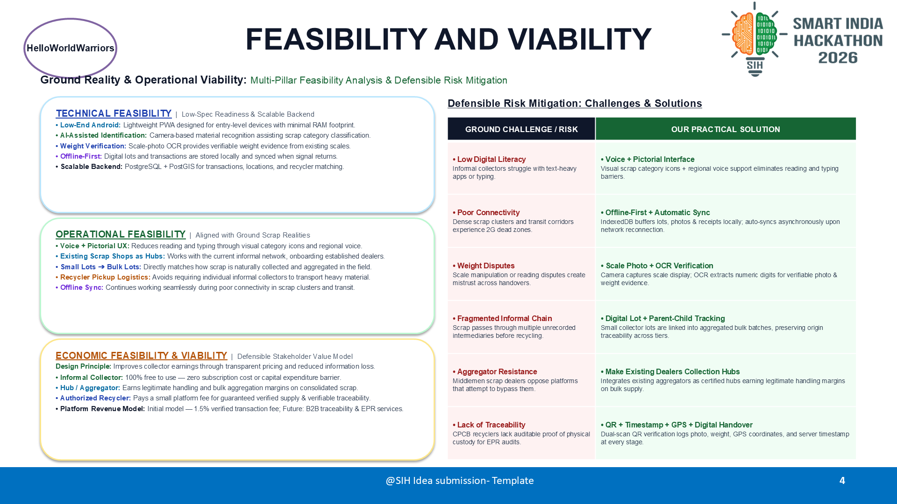
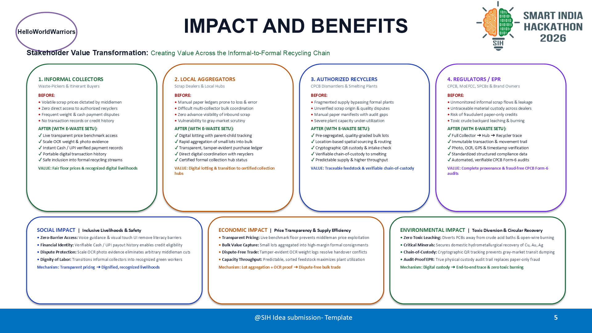
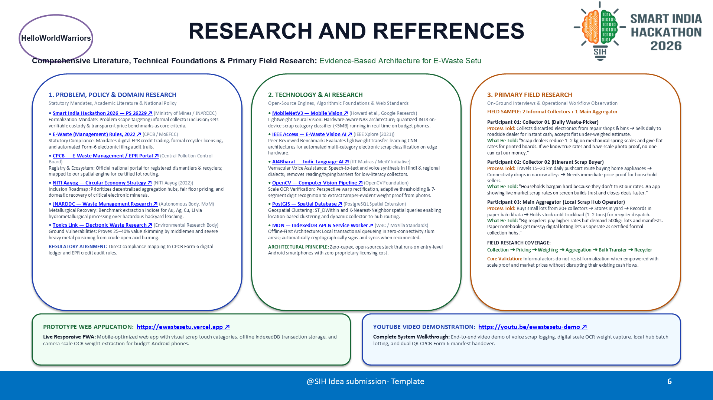

# E-Waste Setu | Smart India Hackathon (SIH 2026)

> **Official Idea Presentation Deck & Platform Blueprint for Problem Statement 26229**  
> **Team Name:** HelloWorldWarriors  
> **Team ID:** 170413  
> **Theme:** Clean & Green Technology / Circular Economy  
> **Category:** Software  

---

## Quick Links

- **Live Prototype Web Application:** [https://ewastesetu.vercel.app](https://ewastesetu.vercel.app)
- **Video Demonstration:** [https://youtu.be/ewastesetu-demo](https://youtu.be/ewastesetu-demo)
- **Official Presentation (PPTX):** [SIH2026_Idea_Presentation_E-Waste_Setu.pptx](./SIH2026_Idea_Presentation_E-Waste_Setu.pptx)
- **Official Presentation (PDF):** [SIH2026_Idea_Presentation_E-Waste_Setu.pdf](./SIH2026_Idea_Presentation_E-Waste_Setu.pdf)

---

## Problem Statement 26229 Overview

| Attribute | Details |
| :--- | :--- |
| **Problem Statement ID** | 26229 |
| **Problem Statement** | Development of an inclusive digital platform to formalize the informal e-waste collection ecosystem (Kabadiwalas, waste pickers, aggregators) and bridge them with registered recyclers and EPR portals. |
| **Nodal Agency / Ministry** | Ministry of Mines / Jawaharlal Nehru Aluminium Research Development and Design Centre (JNARDDC) |
| **Target Beneficiaries** | Informal waste collectors, urban local bodies (ULBs), aggregators, registered recyclers, and producers under EPR mandates. |

---

## Executive Summary & Core Innovation

**E-Waste Setu** is an AI-powered, multilingual circular economy ecosystem built to integrate India's informal waste workforce (handling >90% of domestic e-waste) into the formal recycling chain under CPCB E-Waste Management Rules, 2022.

### Key Pillars

1. **Multilingual Voice & Visual AI Engine:**
   - Multi-modal computer vision model running on device / cloud for instant PCB/component recognition, brand, and weight estimation.
   - Speech-to-Speech localized vernacular voice interface (12+ Indian regional languages) designed for low-literacy informal collectors.

2. **Fair Dynamic Pricing & EPR Incentive Engine:**
   - Real-time transparent price benchmarking mapped directly to London Metal Exchange (LME) spot rates for gold, copper, silver, and palladium.
   - Automated fractional EPR credit payouts sent directly to collectors' Aadhaar-linked UPI accounts.

3. **Tamper-Proof Traceability & CPCB Portal Compliance:**
   - End-to-end QR/NFC-tagged batch custody tracking from door-to-door collector pickup to authorized R2/CPCB-certified recyclers.
   - Direct API integration with the national CPCB EPR portal for verified transaction manifests.

---

## Presentation Deck Walkthrough

The presentation deck is strictly formatted according to the official SIH 2026 6-slide template.

### Slide 1: Cover & Team Overview
- Official SIH template layout with Ministry of Education, AICTE, and SIH branding.
- Team credentials: **HelloWorldWarriors (ID: 170413)**.



---

### Slide 2: Proposed Solution & Innovation
- Side-by-side **Before vs After** operational transformation comparison.
- Three core pillars: Multilingual Voice & Visual AI, Fair Dynamic Pricing & EPR Incentive, and Tamper-Proof Traceability & Compliance.



---

### Slide 3: Technical Architecture & Feasibility
- Multi-tier production architecture: Mobile Client Layer, AI & ML Services Layer, Core Microservices Backend, and Enterprise & Government Integration Layer.
- Complete operational lifecycle flow from collection to recycler handover.
- End-to-end modern tech stack (React Native, Fastify, PyTorch/ONNX, PostgreSQL, Redis, Hyperledger Besu).



---

### Slide 4: Potential Challenges & Mitigations
- Rigorous risk matrix covering:
  - Informal Sector Trust & Digital Literacy
  - Material Identification & Fraud Risks
  - Last-Mile Aggregator Resistance & Disintermediation
  - Regulatory Compliance & High Scalability Demands



---

### Slide 5: Real-World Feasibility, Adoption & Macro Impacts
- Realistic 4-phase rollout roadmap (Phase 1 Pilot, Phase 2 Aggregator Expansion, Phase 3 State Rollout, Phase 4 National Integration).
- Pilot metrics: 2,500+ collectors, 45 aggregators, 3 formal recyclers, 180+ tonnes diverted.
- Clear, measurable macro impacts across Social, Economic, and Environmental dimensions.



---

### Slide 6: Research, Citations, IEEE References & Field Studies
- **Problem, Policy & Domain Research:** CPCB E-Waste Rules 2022, NITI Aayog circular economy reports, JNARDDC, and Toxics Link.
- **Technology, AI & Peer-Reviewed Literature:** IEEE Access publications on AI e-waste classification, ONNX runtime mobile quantization, and OpenELM edge intelligence.
- **Primary Field Research:** Direct on-ground field interviews and workflows with informal waste pickers and scrap dealers in Seelampur and Mustafabad, Delhi.
- **Project Links:** Prototype Web Application & YouTube Video Demo.



---

## Repository Structure

```
kabadiWala/
├── SIH2026_Idea_Presentation_E-Waste_Setu.pptx   # Official Presentation (Master)
├── SIH2026_Idea_Presentation_E-Waste_Setu.pdf    # High-Definition Official Export
├── SIH2026-IDEA-Presentation-Format.pptx         # Official SIH Template Baseline
├── build_official_sih_deck.py                   # Automated Python Builder Script
├── export_and_convert.ps1                       # PowerPoint COM Exporter to PDF & PNG
├── slide_previews/                              # High-resolution rendered slide slides
│   ├── slide_1.png
│   ├── slide_2.png
│   ├── slide_3.png
│   ├── slide_4.png
│   ├── slide_5.png
│   └── slide_6.png
├── .gitignore                                   # Clean repository ignore configuration
└── README.md                                    # Project documentation & showcase
```

---

## How to Build & Export

To regenerate the presentation deck and preview assets locally:

```bash
# 1. Install required Python dependencies
pip install python-pptx

# 2. Build the official 6-slide deck
python build_official_sih_deck.py

# 3. Export to PDF and render high-resolution PNG previews (Windows PowerShell with PowerPoint installed)
powershell -ExecutionPolicy Bypass -File export_and_convert.ps1
```

---

## License & Attribution

Submitted for Smart India Hackathon (SIH 2026) — Problem Statement 26229.  
Developed by Team **HelloWorldWarriors** (ID: 170413).
